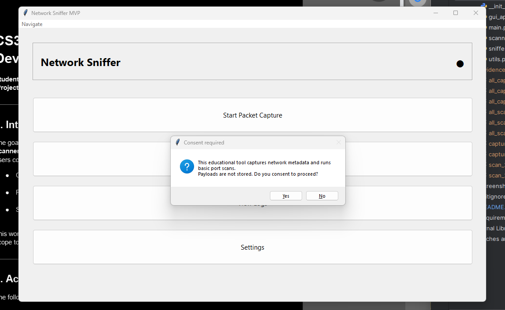
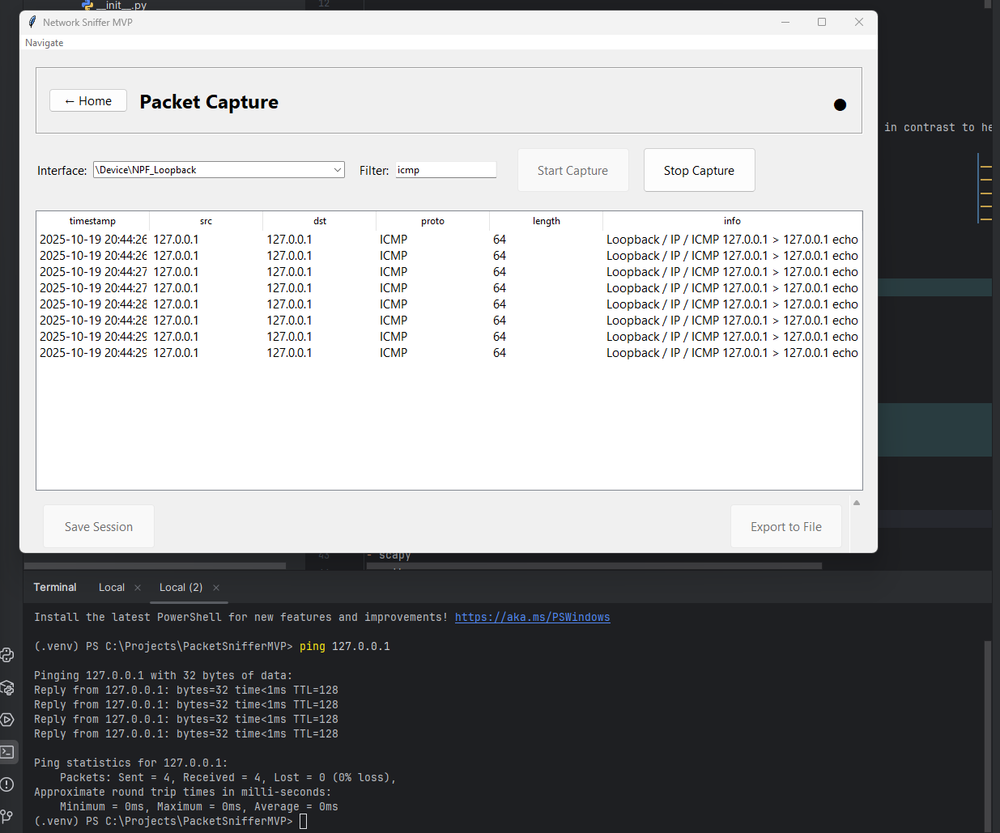
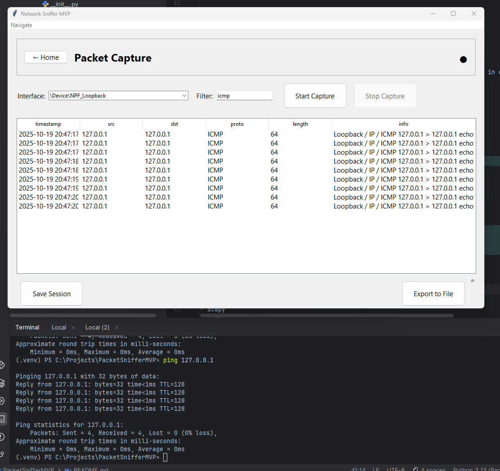
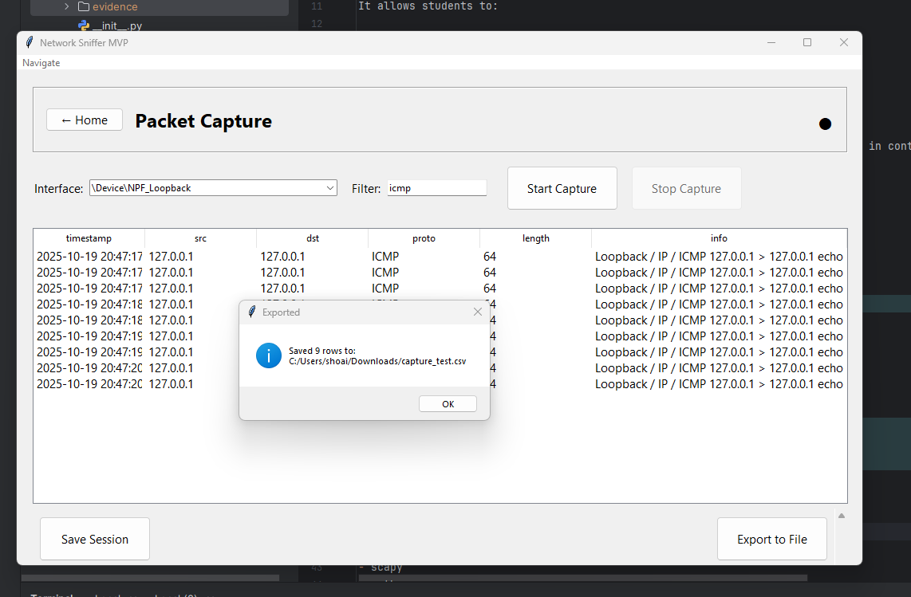
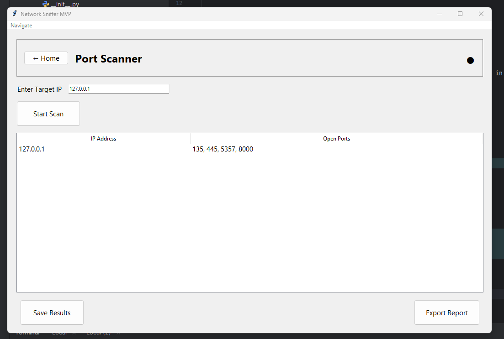
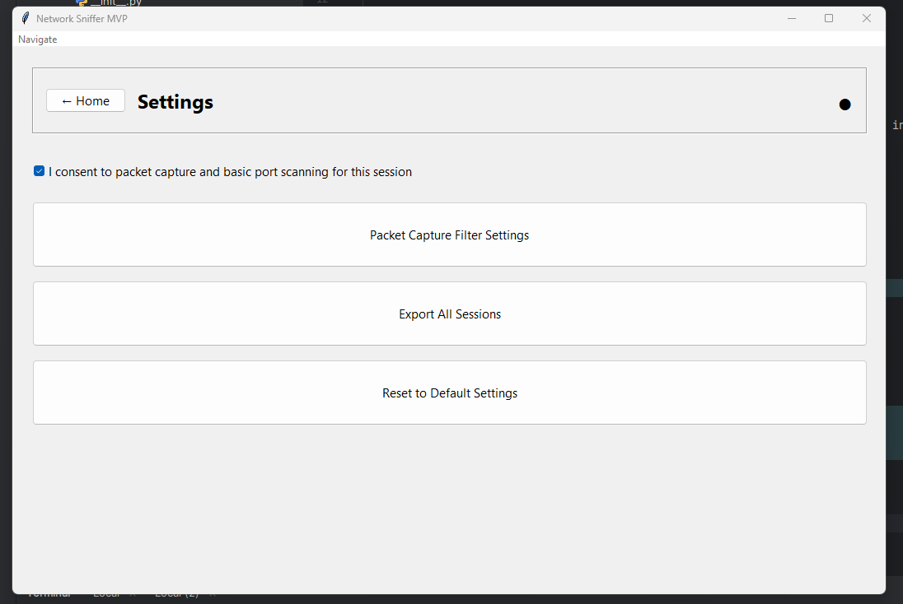
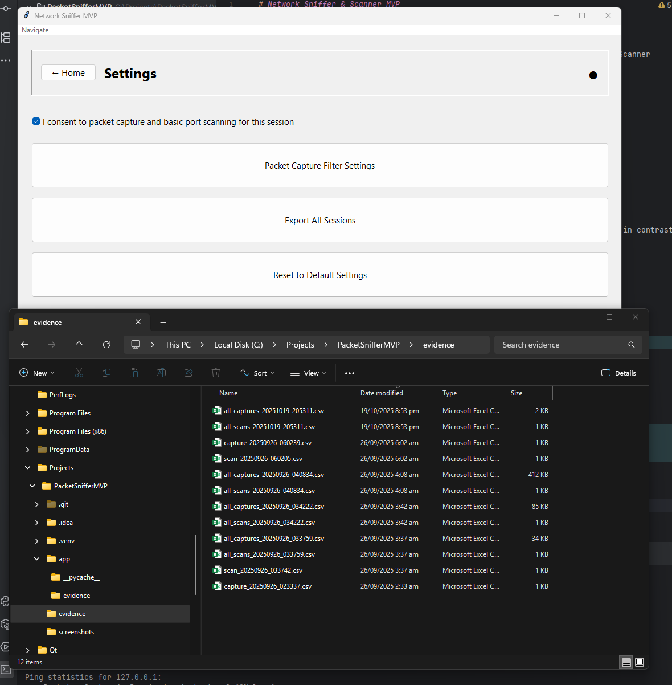
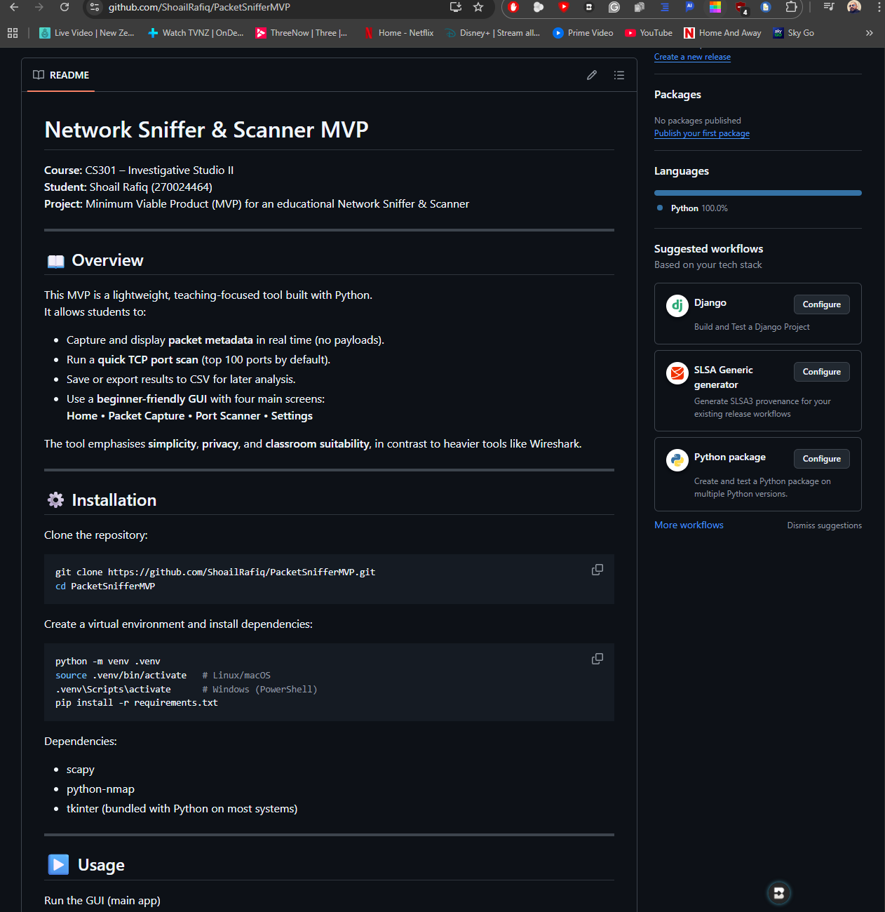

# Network Sniffer & Scanner MVP

**Course:** CS301 – Investigative Studio II  
**Student:** Shoail Rafiq (270024464)  
**Project:** Minimum Viable Product (MVP) for an educational Network Sniffer & Scanner

---

## 📖 Overview
This MVP is a lightweight, teaching-focused tool built with Python.  
It allows students to:

- Capture and display **packet metadata** in real time (no payloads).  
- Run a **quick TCP port scan** (top 100 ports by default).  
- Save or export results to CSV for later analysis.  
- Use a **beginner-friendly GUI** with four main screens:  
  **Home • Packet Capture • Port Scanner • Settings**

The tool emphasises **simplicity**, **privacy**, and **classroom suitability**, in contrast to heavier tools like Wireshark.

---

## ⚙️ Installation

Clone the repository:

```bash
git clone https://github.com/ShoailRafiq/PacketSnifferMVP.git
cd PacketSnifferMVP
```

Create a virtual environment and install dependencies:

```bash
python -m venv .venv
source .venv/bin/activate   # Linux/macOS
.venv\Scripts\activate      # Windows (PowerShell)
pip install -r requirements.txt
```

Dependencies:

- scapy
- python-nmap
- tkinter (bundled with Python on most systems)

---

## ▶️ Usage

Run the GUI (main app)

```bash
python -m app.gui_app
```

Run module harnesses (for testing only)

Sniffer test:

```bash
python -m app.main sniffer
```

Scanner test:

```bash
python -m app.main scanner
```

---

## 🖼️ Screenshots / Evidence

All screenshots are stored in the `/screenshots/` folder.  
These demonstrate the main workflow of the application — from startup consent to exporting data.

---

### 🪪 1. Consent Prompt
  
*Shown on first launch to ensure user consent before any network activity.*

---

### 📡 2. Packet Capture in Progress
  
*Live capture of ICMP packets displayed in the GUI table.*

---

### 🧭 3. Stopped Capture
  
*Capture stopped with packet summary visible in the table.*

---

### 💾 4. Export Dialog Success
  
*Export confirmation after saving captured packets to CSV.*

---

### 🔍 5. Port Scanner Results
  
*Port scanning results showing open ports detected on localhost.*

---

### ⚙️ 6. Settings & Consent Screen
  
*Settings page showing user consent and export controls.*

---

### 📂 7. Evidence Folder View
  
*Saved CSV exports stored automatically in `/evidence/` for analysis.*

---

### 🌐 8. GitHub Repository Overview
  
*Final repository view showing commits, structure, and README preview.*

---

## 🔐 Privacy & Security

- Consent first: All capture and scanning requires explicit user consent.
- Metadata only: No packet payloads are stored or exported.
- Manual persistence: Data saved/exported only when user chooses.
- Local storage: No cloud uploads or external storage.

---

## ⚠️ Known Limitations

### Sniffer
- Stop delay on very quiet networks (stop filter checks when packets arrive).
- GUI updates must occur on the main thread (Tkinter-safe).

### Utils
- CSV export overwrites existing files if the same name is chosen.
- PacketDB (SQLite) exists but not wired into GUI; .close() must be called manually.
- DB is single-user only (not concurrent-safe).

### Scanner
- Blocking scans: GUI may pause briefly during scans.
- Some scans may require admin/root privileges.
- TCP-only quick scans; no UDP or service detection.
- Simplified output: host state + port states only.

### GUI
- Requires Npcap/libpcap installed for interface discovery.
- Default interface may not match the user’s system; must select actual adapter.
- Filter presets not yet implemented (planned for CS302).
- “View Logs” tile is placeholder.
- Windows DPI awareness is best effort; fallback may occur.

### Harness (main.py)
- Hardcoded loopback interface may not exist on all systems.
- Uses a busy loop (while True: pass) → CPU-heavy but fine for demo.

---

## 🧹 Repository Hygiene

This project uses a .gitignore to keep the repo clean:

- __pycache__/, *.pyc → Python caches
- .venv/ → local virtual environment
- evidence/, app/evidence/ → runtime exports (not tracked in Git)

Sample evidence files are included separately in the submission zip.

---

## 🚀 Future Improvements

- Integrate PacketDB fully into the GUI for persistent logging.
- Add filter presets and profiles in GUI.
- More detailed scan reporting (PDF/HTML).
- Support UDP scans and extended range scanning.
- Create executable installer for easier classroom use.
- Add tutorials/help docs within the app.

---

## 🙏 Acknowledgements

- Built with Scapy and python-nmap.
- Developed as part of CS301 (Yoobee College of Creative Innovation).
